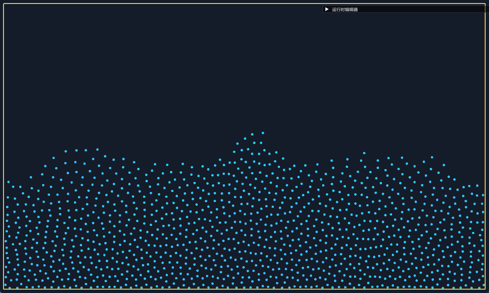
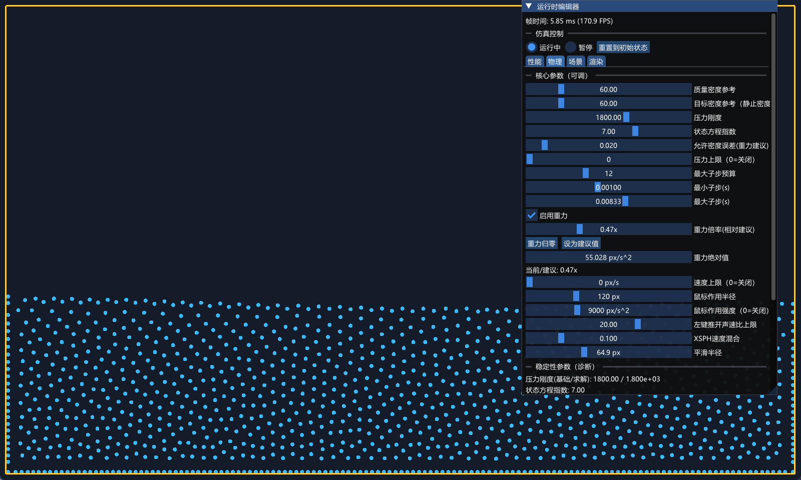

# SDL3 GPU Learning Sandbox

一个用于学习 `SDL3 GPU` 的项目。当前实现已经支持：

- SDL 初始化与窗口生命周期
- GPU 设备创建与窗口绑定
- 每帧交换链渲染通道
- 2D 基本图元绘制（矩形、圆形、三角形、线段、多边形、圆弧）
- 填充与线框（wireframe）绘制
- ImGui 运行时参数编辑器（渲染开关、更新逻辑开关、世界参数调节）
- SPH流体模拟
- 不高效的cuda实现

### 运行环境
- vs2026 v145
- cuda 13.1
- vcpkg
- xmake
注意：cuda并未支持vs2026 需要'-allow-unsupported-compiler'

### 可选：启用 CUDA 后端

前提：

- 已安装 NVIDIA CUDA Toolkit（含 `nvcc`，并在 `PATH` 中可见）
- 有可用 NVIDIA GPU 驱动

命令：

```bash
xmake f -m debug --enable_cuda=y --cuda_arch=native
xmake
xmake run Runtime
```

说明：

- 默认 `--enable_cuda=n`，保持纯 CPU 构建路径
- 运行时会在日志中输出 `CUDA backend: build=ON/OFF` 与可用性探测结果
- 当 `enable_cuda=y` 且 CUDA 可用时，粒子物理更新（密度/压力/粘性/积分）会优先在 CUDA 上计算；失败时自动回退到 CPU 路径

### 运行截图


